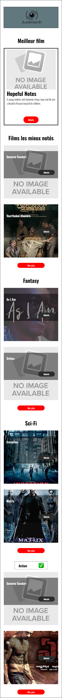

# JustStreamIt

JustStreamIt is a fully responsive front-end web application that displays top-rated movies using the local OCMovies API.  
The project strictly follows the **OpenClassrooms Project 6** specifications: vanilla JavaScript, responsive layout (desktop/tablet/mobile), clean HTML/CSS structure, and API requests via `fetch()`.

---

### Overview

JustStreamIt allows users to browse featured and top-rated movies, explore predefined categories, and dynamically load films from any genre using a dropdown selector.  
A modal displays complete information for each movie.  
The interface adapts smoothly to all screen sizes.

---

### Features

#### Featured movie
- Best-rated film across all categories  
- Poster, title, summary, and **Details** button opening the modal

#### Top-rated movies
- Top 6 IMDb movies (all categories combined)  
- Responsive grid display

#### Category 1 & Category 2
- Two predefined genres  
- Dynamically fetched from the API

#### User-selected category
- Dropdown listing all API genres  
- Reloads displayed movies instantly  
- Responsive fold/unfold behavior preserved

---

### Responsive Behavior

Per the official specifications:

| Device | Visible movies | Hidden movies | Behavior |
|--------|----------------|----------------|----------|
| **Mobile (<768px)** | 2 | 4 | “Show more” displays all |
| **Tablet (768–1280px)** | 4 | 2 | Same toggle logic |
| **Desktop (≥1281px)** | 6 | 0 | Toggle button hidden |

The “Show more / Show less” button appears only on mobile/tablet.

---

### Modal Window

The movie modal includes:

- Poster  
- Title  
- Genres  
- Release year  
- Classification  
- IMDb score  
- Duration  
- Actors  
- Director  
- Country  
- Box office  
- Summary  
- Close button (cross on mobile/tablet)

---

### Tech Stack

- **HTML5**  
- **CSS3** (handcrafted responsive layout)  
- **JavaScript ES6**  
- **Fetch API**  
- **OCMovies-API** (local backend)

---

### Installation — OCMovies API (backend)

API repository:  
https://github.com/OpenClassrooms-Student-Center/OCMovies-API-EN-FR

Install locally:

```bash
git clone https://github.com/OpenClassrooms-Student-Center/OCMovies-API-EN-FR.git
cd OCMovies-API-EN-FR
python -m venv env
source env/bin/activate          # Windows: env\Scripts\activate
pip install -r requirements.txt
python manage.py create_db
python manage.py runserver
```

The API will run at:

http://localhost:8000

---

### Installation — JustStreamIt (frontend)

git clone https://github.com/<your-username>/OC-Projet6-JustStreamIt.git

Open the file in your browser :

JustStreamIt.html

---

#### Models


#### Desktop


#### Tablet


#### Mobile



---

### Project Structure

```text
OC-Projet6-JustStreamIt/
├── oswald/
├── screenshots/
├── style/
│   ├── banner.jpg
│   ├── banner-title.jpg
│   ├── icone.png
│   ├── icone-close.jpg
│   ├── image-not-found.jpg
│   ├── image-not-found-modal.jpg
│   └── logo.jpg
├── JustStreamIt.html
├── main.js
├── script.js
├── README.md
└── README_FR.md
```

---

### Requirements Compliance

- Vanilla JavaScript only
- 100% responsive (mobile/tablet/desktop)
- Uses fetch for all API calls
- No JS frameworks
- No plugins/modules
- No console errors
- Modal fully functional and accessible
- Categories dynamically loaded
- Top-rated movies not hardcoded
- Toggle (“Show more / less”) follows 2/4/6 rule

---

## Author

Alice Nocquet
