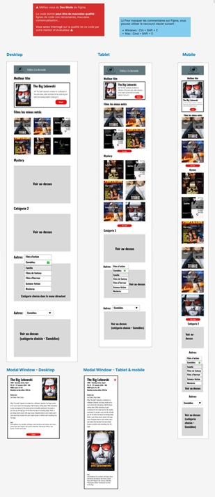
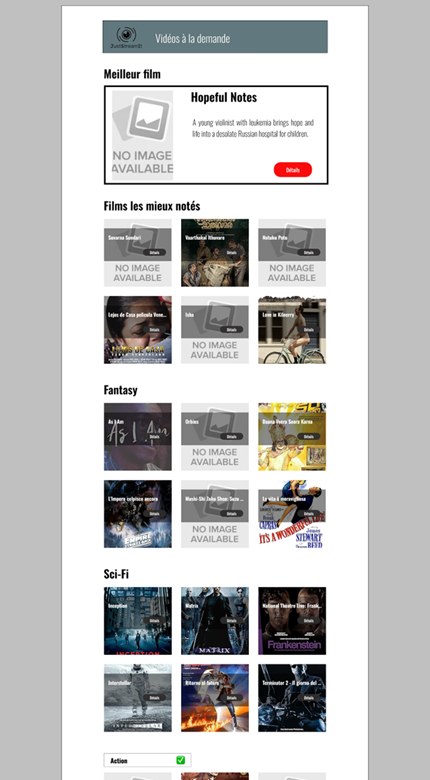

# JustStreamIt

JustStreamIt est une application front-end entièrement responsive permettant d’afficher les films les mieux notés à partir de l’API locale OCMovies.  
Le projet respecte strictement les spécifications du **Projet 6 OpenClassrooms** : JavaScript vanilla, design responsive (desktop/tablette/mobile), structure HTML/CSS propre, et requêtes API via `fetch()`.

---

## Présentation

JustStreamIt permet de naviguer parmi les films en vedette, les films les mieux notés, des catégories prédéfinies, et une catégorie libre sélectionnée via un menu déroulant.  
Une modale affiche toutes les informations détaillées d’un film.  
L’interface s’adapte parfaitement à toutes les tailles d’écran.

---

## Fonctionnalités

### Meilleur film
- Film le mieux noté toutes catégories confondues  
- Affiche, titre, résumé et bouton **Détails** ouvrant la modale

### Films les mieux notés
- Top 6 des films IMDb (toutes catégories)  
- Affichage en grille responsive

### Catégorie 1 & Catégorie 2
- Deux genres prédéfinis  
- Données récupérées dynamiquement via l’API

### Catégorie libre
- Menu déroulant listant tous les genres disponibles via l’API  
- Rechargement instantané de l’affichage des films  
- Comportement responsive repli/affichage conservé

---

## Comportement Responsive

Selon les spécifications officielles :

| Appareil | Films visibles | Films masqués | Comportement |
|----------|----------------|----------------|--------------|
| **Mobile (<768px)** | 2 | 4 | “Voir plus” affiche les films restants |
| **Tablette (768–1280px)** | 4 | 2 | Même logique |
| **Desktop (≥1281px)** | 6 | 0 | Bouton de bascule masqué |

Le bouton “Voir plus / Voir moins” apparaît uniquement sur mobile/tablette.

---

## Fenêtre Modale

La modale d’un film inclut :

- Affiche  
- Titre  
- Genres  
- Année de sortie  
- Classification  
- Score IMDb  
- Durée  
- Acteurs  
- Réalisateur  
- Pays  
- Box-office  
- Résumé  
- Bouton de fermeture (croix en mobile/tablette)

---

## Technologies

- **HTML5**  
- **CSS3** (mise en page responsive manuelle)  
- **JavaScript ES6**  
- **Fetch API**  
- **OCMovies-API** (backend local)

---

## Installation — API OCMovies (backend)

Dépôt API :  
https://github.com/OpenClassrooms-Student-Center/OCMovies-API-EN-FR

Installation locale :

```bash
git clone https://github.com/OpenClassrooms-Student-Center/OCMovies-API-EN-FR.git
cd OCMovies-API-EN-FR
python -m venv env
source env/bin/activate          # Windows : env\Scripts\activate
pip install -r requirements.txt
python manage.py create_db
python manage.py runserver
```

L’API tourne sur :
http://localhost:8000

---

## Installation — JustStreamIt (frontend)

git clone :
https://github.com/<your-username>/OC-Projet6-JustStreamIt.git

Ouvrir dans votre navigateur :

JustStreamIt.html

---

## Captures d’écran

### Maquettes



### Desktop



### Tablette


### Mobile


---

## Structure du Projet

```text
OC-Projet6-JustStreamIt/
├── oswald/
├── screenshots/
├── style/
│   ├── banner.jpg
│   ├── banner-title.jpg
│   ├── icone.png
│   ├── icone-close.jpg
│   ├── image-not-found.jpg
│   ├── image-not-found-modal.jpg
│   └── logo.jpg
├── JustStreamIt.html
├── main.js
├── script.js
├── README.md
└── README_FR.md
```

---

## Conformité aux Exigences

- JavaScript vanilla uniquement
- 100 % responsive (mobile/tablette/desktop)
- Appels API via fetch
- Aucun framework JS
- Aucun plugin/module externe
- Aucune erreur console
- Modale fonctionnelle et accessible
- Catégories chargées dynamiquement
- Top films non codés en dur
- Bouton de bascule conforme à la règle 2/4/6

---

## Auteur

Alice Nocquet
